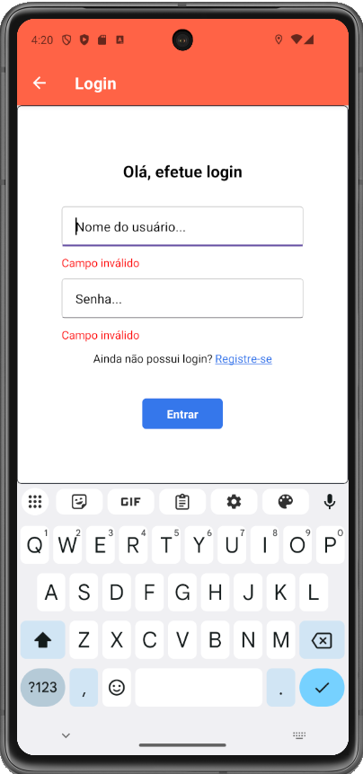
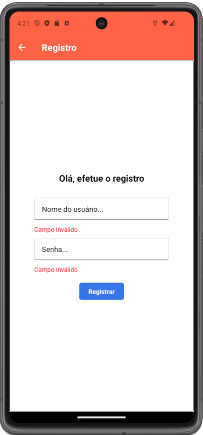
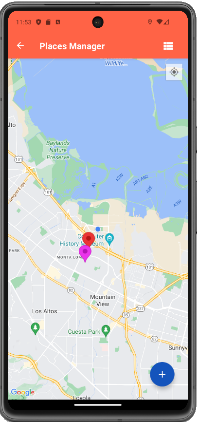
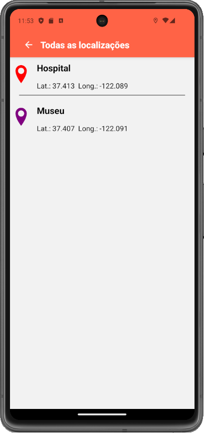
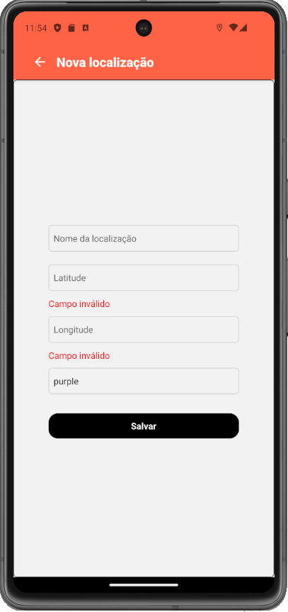
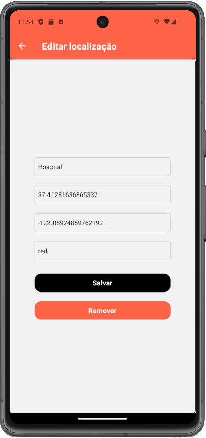
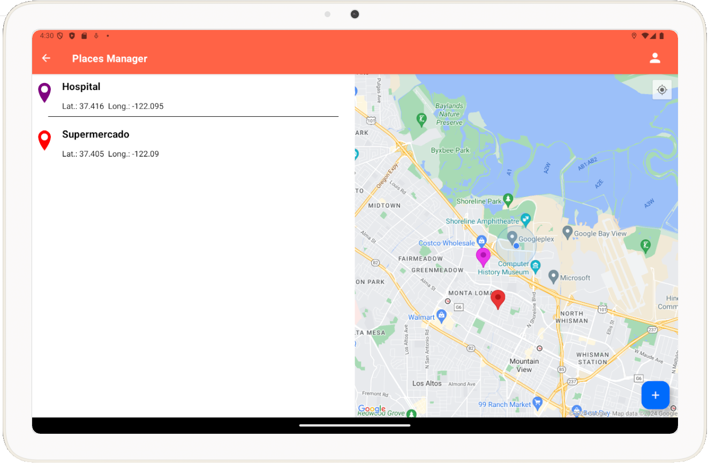

# Aplicativo para guardar localizações importantes

Este aplicativo, denominado "Places Manager", tem como função armazenar localizações importantes definidas pelo usuário. O aplicativo possui as seguintes características:
- Possui tela de login e de registro;
- Na tela Home, aparece um mapa para o usuário marcar os locais que deseja salvar;
- Depois de clicar no mapa, surge um marcador no mesmo que pode ser clicado novamente para abertura de uma tela onde o usuário tem a opção de inserir o nome da localização ou alterar a latitude, longitude e cor do marcador do local escolhido;
- O usuário pode visualizar todos os locais salvos ao se clicar no botão que fica no lado direito da barra superior do aplicativo;
- Ao se abrir a lista com as localizações salvas, o usuário pode clicar em uma localização e editá-la ou apagá-la. Além disso, no topo desta lista consta um botão que, ao ser clicado, exibe uma lista de sugestões de locais interessantes;
- O aplicativo está preparado para utilizar cores mais escuras caso o usuário escolha, no sistema operacional, o tema "dark"; e
- Quando o aplicativo é aberto em um tablet ou em um celular que estão no modo retrato, a lista de locais salvos e o mapa são renderizados lado a lado na tela Home.  

Do ponto de vista técnico, a aplicação possui as seguintes características:
- Foi desenvolvido utilizando a ferramenta Expo, a qual faz uso do framework React Native;
- O registro e o login são realizado por meio da ferramenta Authentication do Google Firebase;
- O locais marcados pelo usuário são salvos localmente, utilizando a biblioteca "expo-sqlite";
- As sugestões de locais interessantes são consultadas por meio de uma API GraphQL utilizando o Apollo Server, sendo que os dados estão incluídos dentro de um arquivo neste aplicativo. Esta API está no repositório https://github.com/kleberga/apollo_server;
- Foram utilizados alguns componentes da biblioteca "React Native Paper", como botões, containers de texto, input de texto e botões flutuantes; e
- A estilização dos componentes foi realizada com as bibliotecas "StyleSheet" e "styled-components".  

As imagens a seguir apresentam a aplicação em funcionamento:

1. Tela de login
   

2. Tela de registro

3. Tela Home

4. Tela Lista de Locais

5. Tela Nova Localização

6. Tela Editar Localização

7. Tela Tablet

